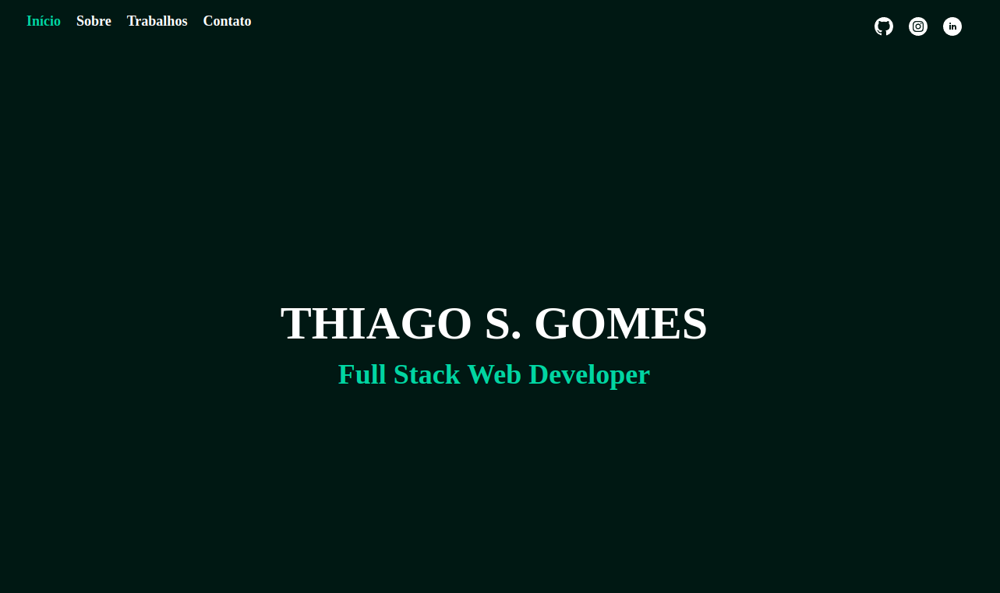

# 🌐 Meu Site Pessoal

Este é meu site pessoal desenvolvido com **React**, utilizando **React Router** para navegação e **Formspree** para envio de formulários. O site está hospedado no **GitHub Pages**.



🔗 **Acesse o site aqui:** [thiagothome.github.io/meu-site](https://thiagothome.github.io/meu-site/#/)

---

## 📌 Tecnologias Utilizadas

- **React** ⚛️
- **React Router** 🚏
- **Formspree** ✉️
- **CSS Modules**
- **GitHub Pages** 🚀 (para deploy)

---

## 🛠️ Instalação e Execução

Para rodar o projeto localmente, siga estes passos:

```bash
# Clone o repositório
git clone https://github.com/thiagothome/meu-site.git

# Entre na pasta do projeto
cd na pasta

# Instale as dependências
npm install

# Inicie o servidor de desenvolvimento
npm run dev
```
